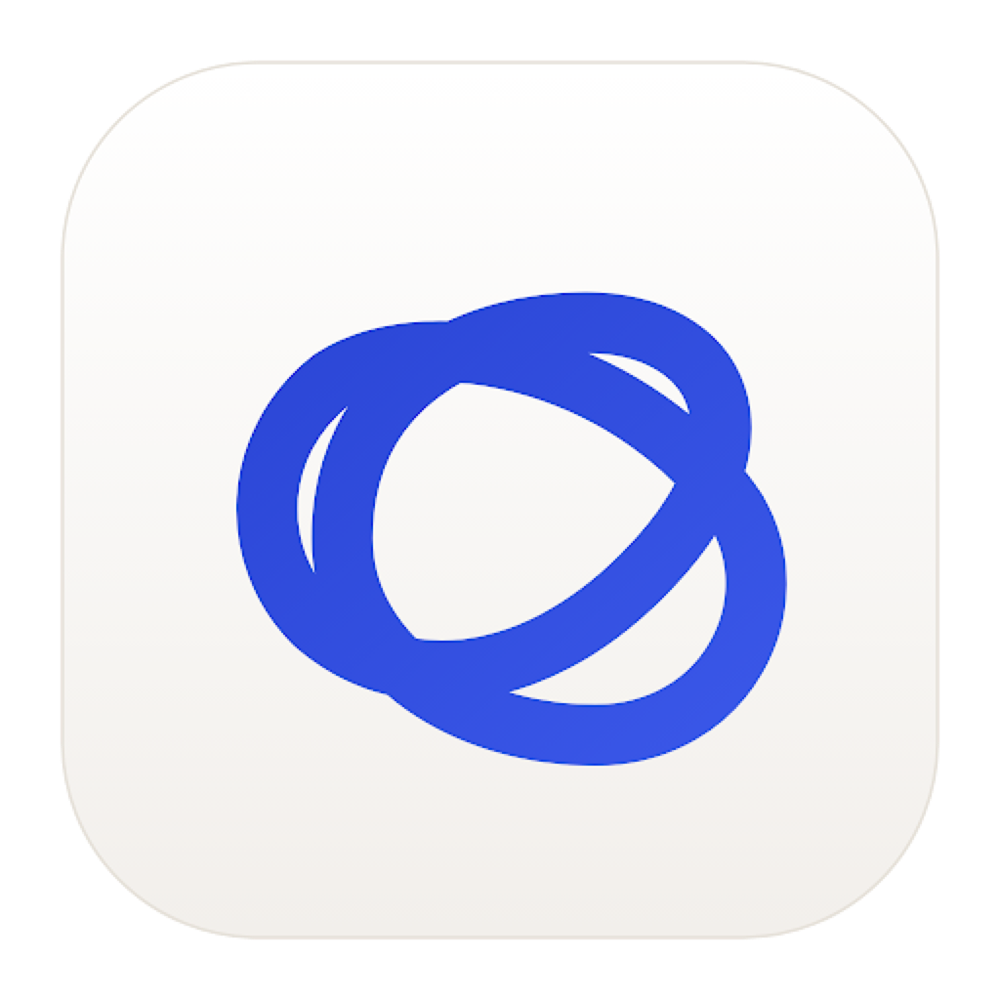

<p align="center">
  
</p>

<h1 align="center">FlowTrace</h1>

<p align="center"><strong>Remember what you were doing. Find it when you forget.</strong></p>

<p align="center">A local-first memory and retrieval app for macOS.</p>

<p align="center">
  <a href="https://github.com/Fuzailkazi/flowtrace/releases">Download for macOS</a>
  · <a href="https://github.com/Fuzailkazi/flowtrace/issues">Report an issue</a>
</p>

FlowTrace keeps useful context from your work — notes, screenshots, browser pages,
terminal sessions, coding-agent sessions, repositories, and projects — so you can
recover it later without remembering exactly where you saw it.

Everything is stored on your Mac. FlowTrace does not require an account or a cloud
backend.

## Download and install

### Recommended: download the app

1. Open the [latest FlowTrace release](https://github.com/Fuzailkazi/flowtrace/releases).
2. Download `FlowTrace-0.1.0-macOS.zip`.
3. Unzip it and move `FlowTrace.app` to `/Applications`.
4. Open FlowTrace from Applications.

The current release is ad-hoc signed for local distribution. If macOS blocks the
first launch, right-click `FlowTrace.app`, choose **Open**, and confirm. If macOS
still reports that the app cannot be opened, run:

```bash
xattr -dr com.apple.quarantine /Applications/FlowTrace.app
```

Then open FlowTrace again. Developer ID signing and notarization are planned for a
future public release.

### Build it yourself

The project supports macOS 14 or later and can be built with the Swift Command Line
Tools; Xcode is not required.

```bash
git clone https://github.com/Fuzailkazi/flowtrace.git
cd flowtrace
./Scripts/bundle.sh release
open dist/FlowTrace.app
```

The build creates `dist/FlowTrace.app`, `dist/flowtrace`, and
`dist/FlowTrace-0.1.0-macOS.zip`.

## First launch

FlowTrace opens its workspace automatically. During onboarding, choose the data
sources you want it to read. Access is opt-in and can be changed later in
**Settings**.

Depending on the features you enable, macOS may ask for Accessibility, Automation,
or Screen Recording permission. FlowTrace does not read page contents, cookies,
form fields, passwords, or private messages. Disable any source in Settings when
you do not want it observed.

## How to use it

### Capture a memory

Press the configured Quick Capture shortcut (the default is `⌥ Space`) from any
app. Choose one of these capture modes:

- **Remember this** — saves a screenshot with surrounding app, window, browser,
  URL, project, and agent context when available.
- **Take a note** — saves your thought and surrounding context; screenshots are
  optional and off by default.

### See what is happening now

The **Now** screen shows active coding sessions, local servers, repositories,
open browser context, unfinished work, and notes on open pages. It is designed to
answer: “What was I doing here?”

### Find something later

Use **Memories** and search with whatever you remember:

```text
the Stripe pricing page
that error from yesterday
the portfolio screenshot
what was I doing in the terminal?
```

FlowTrace searches your notes and locally stored context using SQLite and FTS5.

### Choose a theme

Open **Settings → Appearance** and choose **System**, **Light**, or **Dark**.
The choice is saved across launches. FlowTrace also includes several color palettes.

### Use the CLI

After building the project, run the CLI from the repository or copy it somewhere
on your `PATH`:

```bash
./dist/flowtrace --help
./dist/flowtrace now
./dist/flowtrace scan
./dist/flowtrace list
./dist/flowtrace brief
```

Use `./dist/flowtrace <command> --help` for command-specific options.

## Privacy and storage

FlowTrace is local-first:

- Memories are stored in a local SQLite database.
- Search is performed locally with SQLite FTS5.
- Agent transcripts are read only for sources you explicitly enable.
- Sensitive values are redacted before supported context is persisted.
- No FlowTrace account or cloud service is required.
- The local server, when enabled, is bound to the local machine and uses a token.

The data directory is managed by the app under your macOS application support
directory. Use **Settings → Data** to inspect or remove stored data.

## Browser extension

The optional extension supplies browser-specific context such as the active page
title and URL. To load it during development:

1. Open your browser's extension management page.
2. Enable **Developer mode**.
3. Choose **Load unpacked**.
4. Select the repository's `Extension/` directory.

The extension talks to the local FlowTrace app; it does not upload browsing data.

## Troubleshooting

### FlowTrace is running but I cannot see the workspace

Restart the app from Applications. Current builds open the workspace automatically.
If it is still hidden, use the FlowTrace menu-bar item or run:

```bash
open -a FlowTrace
```

### The capture shortcut does nothing

Open **Settings → Permissions** and confirm Accessibility access for FlowTrace.
Then check the shortcut in **Settings → Shortcut**. Another app may already own
the same key combination.

### Browser context is missing

Enable the relevant browser source in Settings, grant Automation permission when
macOS asks, and make sure the browser is open with a frontmost window.

### I want to remove FlowTrace

Quit FlowTrace, drag `FlowTrace.app` to the Trash, and remove its local data from
**Settings → Data** if you no longer want the stored memories.

## Development

FlowTrace is a Swift and SwiftUI macOS application with shared logic in
`FlowTraceCore`.

```bash
# Build the app
swift build -c debug --product FlowTraceApp

# Run the full test suite
./Scripts/test.sh

# Build, bundle, sign ad-hoc, and launch a release app
./Scripts/bundle.sh release
```

The project includes tests for capture, storage, search, privacy, browser context,
agent adapters, live activity, permissions, and safe process stopping.

## Project structure

```text
Sources/FlowTraceApp/   SwiftUI macOS application
Sources/FlowTraceCore/  local capture, storage, search, and privacy logic
Sources/flowtrace/      command-line interface
Sources/FlowTraceTests/ test suite
Extension/              optional browser extension
Resources/              application icons and bundled resources
Scripts/                build, bundle, test, and development helpers
```

## Design principles

- Capture should be lightweight and not interrupt the user's workflow.
- Context should be collected automatically only after the user opts in.
- Retrieval should work from imperfect human memory.
- Privacy should be a product feature, not an afterthought.
- FlowTrace should stay focused on memory and retrieval, not become a generic
  task manager or cloud knowledge base.

## Status

FlowTrace is actively developed. The current app includes the native macOS
workspace, onboarding and consent controls, Quick Capture, Now, Timeline,
Memories, local search, project and agent context, browser context, local CLI,
optional browser extension support, light/dark themes, and release bundling.

## License

See [LICENSE](LICENSE) for licensing information.
